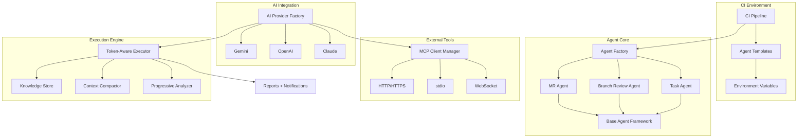

# Architecture Guide

Cicaddy is a platform-agnostic AI agent framework for CI/CD pipelines. It combines AI-powered analysis with external tool execution through MCP (Model Context Protocol).

## System Overview



## Agent Factory

The Agent Factory (`agent/factory.py`) auto-detects agent type from CI environment. Detection is pluggable — platform packages register their own detectors at configurable priorities.

**Detection order:**
1. `AGENT_TYPE` env var (explicit override)
2. `CI_MERGE_REQUEST_IID` exists → MR Agent
3. `TASK_TYPE` exists → Task Agent
4. `CI_PIPELINE_SOURCE`:
   - `merge_request_event` → MR Agent
   - `push` to non-default branch → Branch Review Agent
   - `schedule` → Task Agent
5. Default → Task Agent

## Agent Types

| Agent | Trigger | Purpose | Output |
|-------|---------|---------|--------|
| **MR Agent** | MR event or `CI_MERGE_REQUEST_IID` | Code review of merge request diffs | CI comments + Slack |
| **Branch Review** | Push to non-default branch | Pre-MR branch analysis via local git | Slack only |
| **Task Agent** | Schedule or `TASK_TYPE` set | Independent monitoring/analysis via MCP tools | Slack + reports |

Task Agent operates **independently** of MR/branch context — no CI API dependency for external monitoring tasks. Supports scopes: `full_project`, `external_tools`, `main_branch`, `recent_changes`.

## AI Providers

Multi-provider support with auto-detection based on API key availability.

- **Providers**: Gemini, OpenAI, Claude (`ai_providers/factory.py`)
- **Config**: `AI_PROVIDER` and `AI_MODEL` env vars
- **Features**: Retry logic, error handling, rate limiting

## Token-Aware Execution Engine

Implements LlamaStack-inspired dual-limit patterns for intelligent resource management.

### Safety Valves

| Limit | Config | Purpose |
|-------|--------|---------|
| Iterations | `max_infer_iters` | Prevent infinite AI planning loops |
| Tokens | `max_tokens_total`, `max_tokens_per_iteration` | Cost control |
| Tools | `max_tools_per_iteration`, `max_total_tools` | Prevent tool abuse |
| Time | `max_execution_time`, `max_tool_timeout` | Prevent timeouts |
| Size | `max_result_size_bytes` | Memory protection |

### Progressive Degradation

Analysis quality automatically adapts as resources are consumed:

| Utilization | Level | Behavior |
|-------------|-------|----------|
| 0-70% | COMPREHENSIVE | Full analysis with debug info |
| 70-85% | DETAILED | Key findings, no debug |
| 85-95% | SUMMARY | High-level summary only |
| 95%+ | CRITICAL_ONLY | Errors and critical findings only |

### Recovery

When limits are hit or the AI completes prematurely, the recovery system:
1. Detects incomplete responses (continuation phrases, ultra-short output)
2. Compacts context and extends iteration budget
3. Triggers final synthesis using Knowledge Store data if recovery fails

See [Token-Aware Execution](token-aware-execution.md) for full details.

## Knowledge Store

Dual-storage pattern separating AI conversation efficiency from data preservation.

```
                    +→ Compressed for conversation → AI planning
Tool Result --------+
                    +→ Full data in Knowledge Store → Reports + Slack
```

- **Conversation context**: Compacted to stay within token limits (Layers 1-3)
- **Knowledge Store**: NEVER compacted — preserves every byte from MCP tools

This solves the production issue where successful MCP tool results were lost during conversation compression, producing useless reports.

**Implementation**: `execution/knowledge_store.py` (`AccumulatedKnowledge` class) with triple indexing (execution order, server, tool name).

See [Metadata Architecture](metadata-architecture.md) for full details.

## Context Compactor

Three-layer AI-powered compression achieving 40-60% token savings with >90% quality:

| Layer | When | What |
|-------|------|------|
| 1. Pre-execution | >70% utilization, prompt >1000 tokens | Compress last message before AI call |
| 2. Real-time | Tool result exceeds `max_tokens_per_tool_result` | Compress individual large results |
| 3. Iterative | iteration >3, conversation >50% budget | Compact entire conversation history |

**Tool pair preservation**: Maintains tool request/response pairs during compression to prevent AI confusion. Uses `_identify_tool_pairs()` to track related messages.

## "Last Message Only" Pattern

Only the final assistant message is used as output. This eliminates complex multi-turn aggregation (130+ lines removed) and produces focused, comprehensive reviews.

**Critical consequence**: Tool calls in early iterations won't appear in output unless the final message references them. Prompts must invoke tools EARLY, then synthesize in the final message.

See the [cicaddy-gitlab prompt engineering guide](https://github.com/redhat-community-ai-tools/cicaddy-gitlab/blob/main/docs/prompt-engineering-best-practices.md) for patterns.

## Reports and Notifications

- **Reports**: JSON (structured) + HTML (visual) using Knowledge Store data
- **Slack**: Rich notifications with tool result summaries
- **CI Comments**: MR Agent posts analysis as merge request comments
- **Key insight**: Reports use `accumulated_knowledge` for complete tool data, not compacted conversation

## Related Documentation

- [Metadata Architecture](metadata-architecture.md) — Knowledge Store, compression coordination, tool pair preservation
- [Token-Aware Execution](token-aware-execution.md) — Resource management and progressive degradation
- [MCP Integration](mcp-integration.md) — MCP server configuration and deployment
